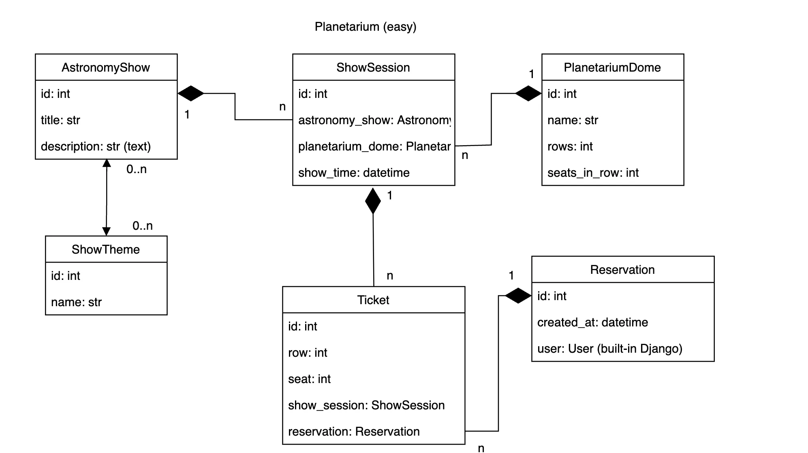

# DRF API Project with Docker Compose

## 📌 Description
This project is a REST API built on the Django REST Framework (DRF).
It uses Docker and Docker Compose to simplify deployment.
The Planetarium_service project provides functionality for creating orders for
planetarium sessions. It has the ability to create, update, and delete.
Send email notifications to the user when an order is created.

## 📦 Functionality
- API for resource management
- Authentication via JWT
- Using PostgreSQL as a database
- Swagger and Redoc documentation
- Running in Docker containers
- MailHog

---

## 🚀 Project launch

### 🔧 Requirements
- [Docker](https://www.docker.com/get-started)
- [Docker Compose](https://docs.docker.com/compose/install/)

### 📥 Cloning a repository
```sh
git clone https://github.com/Professor-Douel/Planetarium_service.git
```

### 🔑 Configuring the .env file
Create a `.env` file in the root directory and specify the environment variables:
```env
POSTGRES_PASSWORD=<db_password>
POSTGRES_USER=<db_user>
POSTGRES_DB=<db_name>
POSTGRES_HOST=<db_host>
POSTGRES_PORT=<db_port>
PGDATA=/var/lib/postgresql/data
EMAIL_HOST_USER=<your_email>
EMAIL_HOST_PASSWORD=<app_key_from_2FA_of_your_email_account>
SECRET_KEY=<your_secret_key>
```

### 🏗️ Launch containers
```sh
docker-compose up --build
```
This command will build and run the containers.

### Migrations, creating a superuser, and loading the fixture are specified in
### the docker-compose file and will be created when building the containers.
- superuser_email: admin@example.com
- superuser_password: 1qazcde3

---

## 🔥 Using APIs

### 📜 Documentation
- Swagger UI: [http://localhost:8001/api/doc/swagger/]
- Redoc: [http://localhost:8001/api/doc/redoc/]

### 🔐 Authentication
API use JWT-authentication. Get token you can through:
```sh
POST http://localhost:8001/api/token/
```
- Pass the received `access` token in the `Authorization: Bearer <your_token>`
header for subsequent requests.

### 📌 Example API request
Getting a list of objects:
```sh
GET http://localhost:8001/api/item/
```
### Example MailHog request
```sh
GET http://localhost:8025/
```

---

## 🔧 Main commands

### 🛑 Stop the containers
```sh
docker-compose down
```

### 🔄 Restart the containers
```sh
docker-compose restart
```

---

## 📂 Structure of the project
```
.
├── planetarium/         # Django app
├   ├──management/       # For creating custom commands
├   ├  └──commands/      # Contains custom commands for manage.py
├   ├
├   └──migrations/       # Contains migrations
├
├── Planetarium_service/ # Directory of the project
├
├── user/                # Django app
├   └──migrations/       # Contains migrations
├
├── .gitignore           # Contains files that should not be included in commits
├── .dockerignore        # Contains files that should not be included in the docker image
├── docker-compose.yaml  # File of configurations for Docker Compose
├── Dockerfile           # Instructions for creating container
├── manage.py            # Enter point for commands in Django
├── requirements.txt     # Python dependencies   
├── seed_data.json       # File for load fixtures   
└── README.md            # Documentation
```




